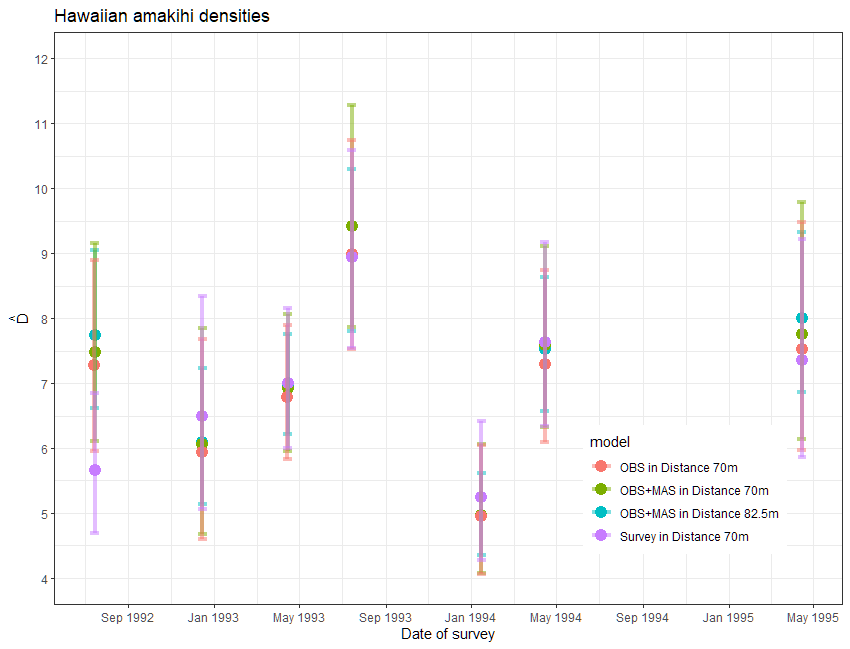

```{r setup, include=FALSE}
knitr::opts_chunk$set(echo = TRUE, warning = FALSE, message = FALSE)
library(knitr)
library(kableExtra)
```

::: {.alert .alert-success}
<strong>Solutions</strong> Covariates in the detection function
:::

# Covariates in point transect detection functions: Amakihi

```{r}
library(Distance)
data(amakihi)
```

```{r, fig.height=4}
hist(amakihi$distance, xlab="Radial distances (m)", main="Amakihi point transect data.")
```

A truncation distance of 82.5 m was chosen by Marques *et al.* [-@Marques2007].

Plots of the covariates were generated. Not surprisingly, `MAS` and `HAS` are correlated and so we need to be cautious of including them in the same model.

```{r, fig.height=8}
# Plots of covariates
par(mfrow=c(2,2))
# Boxplots by obs
boxplot(amakihi$distance~amakihi$OBs, xlab="Observer", ylab="Distance (m)")
# Boxplots by hour after sunrise
boxplot(amakihi$distance~amakihi$HAS, xlab="Hour", ylab="Distance (m)")
# Plot of MAS vs distance (using dots)
plot(x=amakihi$MAS, y=amakihi$distance, xlab="Minutes after sunrise",
     ylab="Distance (m)", pch=20)
# Plot of HAS vs MAS (using dots)
plot(x=amakihi$HAS, y=amakihi$MAS, xlab="Hours after sunrise",
     ylab="Minutes after sunrise", pch=20)
```

```{r}
# Adjusting the raw data
# Convert HAS to a factor
amakihi$HAS <- factor(amakihi$HAS)
# Set the reference level 
amakihi$OBs <- relevel(amakihi$OBs, ref="TKP")
amakihi$HAS <- relevel(amakihi$HAS, ref="5")
```

The model selected by Marques *et al.* [-@Marques2007] used a hazard rate key function and included observer and minutes after sunrise (treating time as a continuous rather than discrete covariate)- this model is fitted below. The PDF plot is shown.

```{r, fig.height=5, message=FALSE, warning=FALSE}
# Fit model selected by Marques et al (2007)
conv <- convert_units("meter", NULL, "hectare")
amak.hr.obs.mas <- ds(amakihi, transect="point", key="hr", formula=~OBs+MAS, convert_units = conv,
                      truncation=82.5)

# Plot selected model

plot(amak.hr.obs.mas, showpoints=FALSE, main="Amakihi Observer and Minutes", pdf=TRUE)
sfzero <- data.frame(OBs="SGF", MAS=0)
sf180 <- data.frame(OBs="SGF", MAS=180)
t1zero <- data.frame(OBs="TJS", MAS=0)
t1180 <- data.frame(OBs="TJS", MAS=180)
t2zero <- data.frame(OBs="TKP", MAS=0)
t2180 <- data.frame(OBs="TKP", MAS=180)

add_df_covar_line(amak.hr.obs.mas, data=sfzero, lty=1, lwd=2,col="blue", pdf=TRUE)
add_df_covar_line(amak.hr.obs.mas, data=sf180, lty=2, lwd=2,col="blue", pdf=TRUE)
add_df_covar_line(amak.hr.obs.mas, data=t1zero, lty=1,lwd=2,col="red", pdf=TRUE)
add_df_covar_line(amak.hr.obs.mas, data=t1180, lty=2, lwd=2,col="red", pdf=TRUE)
add_df_covar_line(amak.hr.obs.mas, data=t2zero, lty=1,lwd=2,col="green", pdf=TRUE)
add_df_covar_line(amak.hr.obs.mas, data=t2180, lty=2, lwd=2,col="green", pdf=TRUE)

legend("topright", legend=c("SF, minutes=0",
                            "SF, minutes=180",
                            "TS, minutes=0",
                            "TS, minutes=180",
                            "TP, minutes=0",
                            "TP, minutes=180"),
       title="Covariate combination: observer and minutes",
       lty=rep(c(1,2),times=3), lwd=2, col=rep(c("blue","red","green"), each=2))
```

::: {.alert .alert-danger}
<strong>Cautionary tale</strong> A second round of model criticism
:::

The model chosen by Marques et al. [-@Marques2007] for making inference included minutes after sunrise (MAS) and observer (OBS) as covariates in the detection function. Did that model produce estimates of detection probability that were small for some detections? Recall, because we are using a Horwitz-Thompson-like estimator, our estimates of abundance are quite sensitive to detections with small values of $\widehat{P_a(z_i)}$. Detections with small $\widehat{P_a(z_i)}$ can have quite large impacts upon population estimates.

A new function in the most recent version of the `Distance` package, permits examination of the distribution of the $\widehat{P_a(z_i)}$ so we can assess whether this analysis guideline is violated:

> consider reducing the trunction distance if more than 5% of the $\widehat{P_a(z_i)}$ are \< 0.2, or if any are less than 0.1

```{r distp, eval=FALSE}
p_dist_table(amak.hr.obs.mas, proportion = TRUE)
```

```{r distp2, echo=FALSE}
kable(p_dist_table(amak.hr.obs.mas, bins=seq(0, 0.6, 0.1), proportion = TRUE),
      digits = 3,
      caption="Distribution of $P_a(z_i)$ from preferred model when w=82.5") %>%
  kable_styling(full_width=FALSE) %>%
  row_spec(2, bold=TRUE, color="white", background="blue")
```

This suggests redoing the analysis with stronger truncation. I'll repeat the model fitting (without showing the code) using 70m as the truncation distance. What do we see when examining the distribution of the $\widehat{P_a(z_i)}$ with the more stringent truncation?

```{r moretrunc, echo=FALSE, eval=TRUE}
amak.hr.obs.mas.70 <- ds(amakihi, transect="point", key="hr", formula=~OBs+MAS, convert_units = conv,
                      truncation=70)
kable(p_dist_table(amak.hr.obs.mas.70, bins=seq(0, 0.6, 0.1), proportion = TRUE),
      digits = 3,
      caption="Distribution of $P_a(z_i)$ from preferred model when w=70") %>%
  kable_styling(full_width=FALSE) %>%
  row_spec(2, bold=TRUE, color="white", background="blue")
```

*Should this much truncation cause concern for point estimates and precision?*

The news that model criticism should start over with a new truncation distance would not be good news. Concerns might also creep into your heads that removing data might affect the point estimates and possibly the precision. In this case, moving the truncation distance from 82.5m to 70m removed only 1.5% (19) detections, so it is unlikely that precision was affected.

Regarding the effect upon the point estimates of amakihi density, let's take a step back. If you were to examine the point and interval estimates for this data set from a number of detection function models, you would find the estimates are robust to model choice.

```{r estfigs, fig.cap="Density estimates for amakihi data set under a variety of detection function models and truncation distances.", echo=FALSE, out.width="80%"}

```

*My impression*

For this data set, the effort expended in discriminating between models with one vs two covariates as well as the angst about truncation distances had **imperceptible effects** upon the survey-specific density estimates. In fact, a model simply using survey replicate as a covariate produced largely the same density estimates. Understanding the temporal dynamics of the amakihi population was not influenced by covariate modelling.

```{=html}
<!--
To see more sophisticated examples of plotting the detection function for the selected model, see the code accompanying Buckland *et al.* (2015) [Hawaiian Amakihi case study](https://synergy.st-andrews.ac.uk/ds-manda/#hawaiian-amakihi-case-study).
-->
```
# More MCDS with line transects: ETP dolphins (optional)

We have not provided a comprehensive analysis of these data but have highlighted a few general feature of these data.  A more complete analysis can be found in @FMARBUC03.

```{r}
data(ETP_Dolphin)
head(ETP_Dolphin, n=3)
# Check conversion units
ETP_Dolphin_units[,1:2]
```

Notice that effort and perpendicular distances are both measured in nautical miles and that density is to be reported in animals per square nautical mile, so the conversation factor in this case is 1 and we do not represent it here.

To obtain an overall impression of the data, it is useful to fit a histogram with many intervals.

```{r, fig.height=4}
# Histogram of distances with lots of intervals
hist(ETP_Dolphin$distance, nclass=50, xlab="Distance (nm)",
     main="Tropical Pacific dolphin survey perpendicular distances")
```

The spikes in the histogram suggest that distances have been rounded to zero and possibly other values. To mitigate these problems, the distances could be binned although we do not do so in the analysis below. The distances have already been truncated at 5 nm and so we will not truncate distances further.

```{r, fig.height=6}
# Boxplots of distances against factor covariates
par(mfrow=c(2,2))
# Search method
boxplot(ETP_Dolphin$distance~ETP_Dolphin$Search.method, xlab="Search method", 
        ylab="Distance (nm)")
# Cue 
boxplot(ETP_Dolphin$distance~ETP_Dolphin$Cue.type, xlab="Cue", ylab="Distance (nm)")
# Beaufort 
boxplot(ETP_Dolphin$distance~ETP_Dolphin$Beauf.class, xlab="Beaufort class", 
        ylab="Distance (nm)")
# Month
boxplot(ETP_Dolphin$distance~ETP_Dolphin$Month, xlab="Month", ylab="Distance (nm)")
```

To decide whether to fit a half normal or a hazard rate key function, each of these is tried in turn.

```{r, message=FALSE}
# Fit basic detection functions 
# Half normal
etp.hn <- ds(ETP_Dolphin, key="hn", adjustment=NULL)
# Hazard rate
etp.hr <- ds(ETP_Dolphin, key="hr", adjustment=NULL)
# Compare these fits
knitr::kable(as.data.frame(AIC(etp.hn, etp.hr))) %>%
    kable_styling(bootstrap_options = "condensed", full_width = F)  
```

The AIC values suggest that hazard rate key function is preferable to the half normal and so this will be used as the key function in the MCDS models. Each covariate is introduced in turn.

```{r, message=FALSE}
# Add covariates to hazard rate detection function
# Search method (factor)
etp.hr.search <- ds(ETP_Dolphin, key="hr", formula=~factor(Search.method))
# Cue type (factor)
etp.hr.cue <- ds(ETP_Dolphin, key="hr", formula=~factor(Cue.type))
# Beaufort class (factor)
etp.hr.bf <- ds(ETP_Dolphin, key="hr", formula=~factor(Beauf.class))
# Month (factor)
etp.hr.month <- ds(ETP_Dolphin, key="hr", formula=~factor(Month))

# Compare models (using pretty printing)
knitr::kable(summarize_ds_models(etp.hr, etp.hr.search, etp.hr.cue, etp.hr.bf, etp.hr.month),
               caption="ETP dolphin model selection.", digits=3) %>%
       kable_styling(bootstrap_options = "condensed", full_width = F)  
```

Based on the AIC, it seems as though the model including search method was preferable and we could continue the model selection process by looking at models with two covariates. However, before going on it is worth looking at the search method model in more detail. If we look at the detection function parameters for this model:

```{r}
# Look at detection function part of the model object
etp.hr.search$ddf
```

we see that the estimated scale coefficient for search method 3 is substantially larger than the estimated scale coefficients for other methods. The effect this has on the detection function is clearly seen in the detection function plot.

```{r, fig.height=4}
# Plot search method detection function
plot(etp.hr.search, pch=".")
```

Search method 3 indicated that the detection was from a helicopter and this detection function suggests that all dolphin schools out to 5 nm were being detected and so detection does not decrease as distance increases. One assumption of MCDS is that the perpendicular distance distributions of the covariate factor levels have the same shape and so it may be worth refitting the models but excluding the observations made by the helicopter.

## Colourful plot noting effect of cue type

Just an example of using the function `add_df_covar_line` to visually explore consequences of covariates on the detection function. A *regular* call to `plot()` is first used to produce the histogram and average detection function line; subsequent calls to the new function with different values of the covariate of interest completes the plot.

```{r, colourful, fig.height=4, fig.cap="Detection function with cue type as covariate."}
plot(etp.hr.cue, main="ETP dolphin survey", showpoints=FALSE)
add_df_covar_line(etp.hr.cue, data = data.frame(Cue.type=1), col='red', lwd=2, lty=1)
add_df_covar_line(etp.hr.cue, data = data.frame(Cue.type=2), col='blue', lwd=2, lty=1)
add_df_covar_line(etp.hr.cue, data = data.frame(Cue.type=3), col='green', lwd=2, lty=1)
add_df_covar_line(etp.hr.cue, data = data.frame(Cue.type=4), col='purple', lwd=2, lty=1)
legend("topright", legend=c("Birds","Splashes","Unspecified","Floating objects"),
       col=c("red", "blue", "green", "purple"), lwd=2, title = "Cue type")
```

# More MCDS with point transects: Savannah sparrow (optional)

Recall, these are data from Colorado, described by @knopf1988.  The question here was whether to include pasture as a covariate in the detection function.  The biological question being, "does detectability of Savannah sparrows differ between the pastures in which the survey was conducted."

```{r, fig.width=4, fig.height=4}
# Savannah sparrow 1980
data(Savannah_sparrow_1980)
# Check data
head(Savannah_sparrow_1980, n=3)
# Histogram of distances with lots of bins
hist(Savannah_sparrow_1980$distance, nclass=20, xlab="Distance (m)",
     main="Savannah sparrow radial distances '80")
conversion.factor <- convert_units("meter", NULL, "hectare")
```

A truncation distance of 55m was chosen. The half normal and hazard rate functions were tried in turn, allowing AIC selection of cosine adjustment terms, then pasture was included as a covariate in the detection function.

```{r, eval=TRUE, message=FALSE, warning=FALSE}
# Fit different detection functions, truncation at 55m
# Half-normal 
Savannah_sparrow_1980.hn <- ds(data=Savannah_sparrow_1980, key="hn", adjustment="cos", truncation=55,
                 transect="point", convert_units=conversion.factor)
# Hazard
Savannah_sparrow_1980.hr <- ds(data=Savannah_sparrow_1980, key="hr", adjustment="cos", truncation=55,
                 transect="point", convert_units=conversion.factor)

# Half-normal with pasture covariate
Savannah_sparrow_1980.hn.region <- ds(data=Savannah_sparrow_1980, key="hn", truncation=55,
                        transect="point", convert_units=conversion.factor,
                        formula=~Region.Label)
# Hazard with pasture covariate
Savannah_sparrow_1980.hr.region <- ds(data=Savannah_sparrow_1980, key="hr", truncation=55,
                        transect="point", convert_units=conversion.factor,
                        formula=~Region.Label)
# Select between these models
AIC(Savannah_sparrow_1980.hn, Savannah_sparrow_1980.hr, Savannah_sparrow_1980.hn.region, Savannah_sparrow_1980.hr.region)
```

The half normal model with pasture as a covariate had a marginally smaller AIC than the half normal model without pasture. The plots and estimates are shown below.

```{r, fig.cap="Note different PDF shapes caused by the pasture covariate."}
# Plot results of selected model
plot(Savannah_sparrow_1980.hn.region, pch=".", pdf=TRUE)
```

```{r}
# Summarise results for selected model
summary(Savannah_sparrow_1980.hn.region)
```

A similar process was conducted for the 1981 data: a truncation distance of 55m was again used.

```{r}
# Savannah sparrow 1981
data(Savannah_sparrow_1981)
conversion.factor <- convert_units("meter", NULL, "hectare")
```

```{r, eval=T, message=FALSE, warning=FALSE}
# Fit alternative models 
# Half-normal detection function, truncation 55m 
Savannah_sparrow_1981.hn <- ds(data=Savannah_sparrow_1981, key="hn", adjustment="cos", truncation=55,
                 transect="point", convert_units=conversion.factor)
# Hazard rate
Savannah_sparrow_1981.hr <- ds(data=Savannah_sparrow_1981, key="hr", adjustment="cos", truncation=55,
                 transect="point", convert_units=conversion.factor)
# Half normal with pasture
Savannah_sparrow_1981.hn.region <- ds(data=Savannah_sparrow_1981, key="hn", truncation=55,
                        transect="point", convert_units=conversion.factor,
                        formula=~Region.Label)
# Hazard rate with pasture
Savannah_sparrow_1981.hr.region <- ds(data=Savannah_sparrow_1981, key="hr", truncation=55,
                        transect="point", convert_units=conversion.factor,
                        formula=~Region.Label)
# Compare models
AIC(Savannah_sparrow_1981.hn, Savannah_sparrow_1981.hr, Savannah_sparrow_1981.hn.region, Savannah_sparrow_1981.hr.region)
```

For 1981, there was a clear preference for including pasture as a covariate in the detection function but little to choose from between the half normal and hazard rate key function. For comparability with 1980, the plots and results below are for the half normal model although AIC showed a slight preference for the hazard rate model. The differences in detection between pastures can easily be seen and this is reflected in the estimated densities (birds per hectare).

```{r, fig.height=6, fig.width=8, fig.cap="Stronger influence of pasture covariate seen here."}
pastures <- unique(Savannah_sparrow_1981$Region.Label)
plot(Savannah_sparrow_1981.hn.region, showpoints=FALSE, 
     main="Savannah sparrows with pasture covariate", pdf=TRUE)
k <- 1
for (i in pastures) {
  k <- k+1
  add_df_covar_line(Savannah_sparrow_1981.hn.region, 
                    data=data.frame(Region.Label=as.character(i)),
                    lty=1, col=k, lwd=3, pdf=TRUE)
}
legend("topright", legend=tolower(as.character(pastures)), 
       col=2:k, lwd=2, title = "Pastures")
text(-2,0.038, cex=0.9, pos=4,
     expression(widehat(sigma[p])==plain(exp)(widehat(beta[0]) + widehat(beta[1]) %.% p[1] + widehat(beta[2]) %.% p[2] + widehat(beta[3]) %.% p[3])))
library(plotrix)
parms <- data.frame(est=c(2.944, 0.736, 0.166, 0.271),
                    se=c(0.111, 0.373, 0.153, 0.179))
rownames(parms) <- c("b0", "b1", "b2", "b3")
addtable2plot(2, 0.027, parms, bty="o",
              display.rownames=TRUE,hlines=TRUE, cex=0.8,
              xpad=0.4, vlines=FALSE,title="Parameter estimates")
# Summary of results for selected model
summary(Savannah_sparrow_1981.hn.region)
```

In these models, the detection functions have been fitted to all the detections within the study region (for each year). An alternative would be to fit separate detection functions within each pasture (specified in `Region.Label`), provided there are enough detections. This would allow different shape detection functions to be fitted in each pasture (providing this is a reasonable thing to do).

# References
